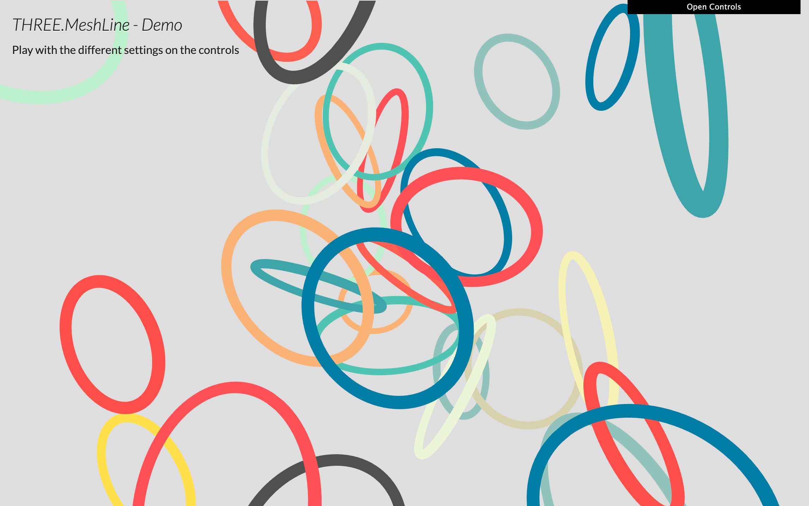
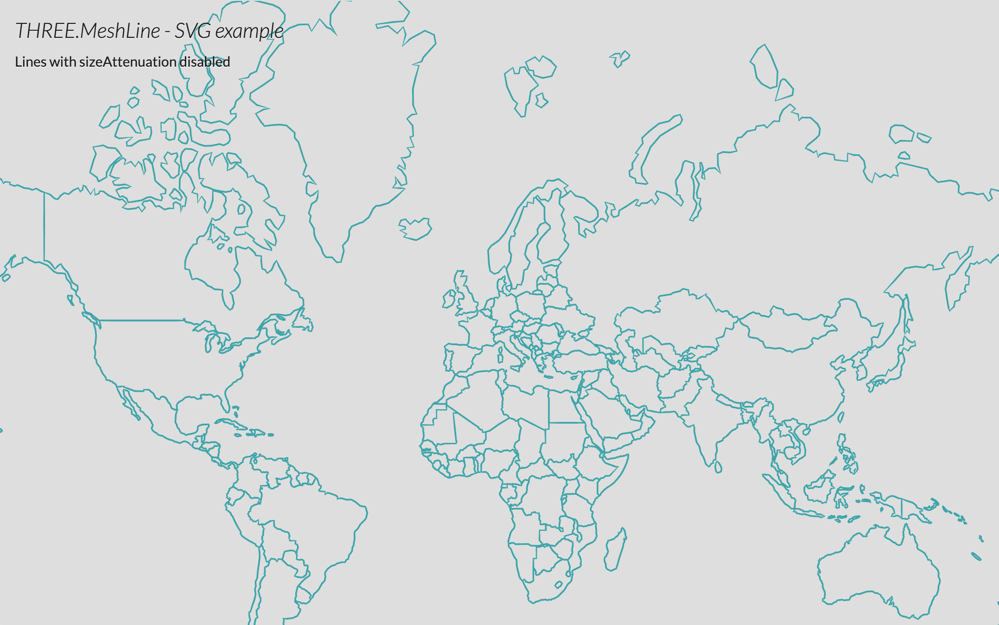

# @lume/three-meshline

Provides a Mesh-based replacement for `THREE.Line` from
[Three.js](http://threejs.org), allowing line thicknesses of any size
(`THREE.Line` is limited to 1 pixel width), and other features.

> **Note** This is forked from
> [`three.meshline`](https://github.com/lume/three-meshline), as that project has
> been dormant. The version of this starts at 2.0 because it modernizes the code
> base in ways that make it a breaking change, and removes deprecated features.

Instead of using GL_LINE, it uses a strip of triangles billboarded. Some examples:

[](http://spite.github.io/THREE.MeshLine/demo/index.html)
[](http://spite.github.io/THREE.MeshLine/demo/graph.html)
[](http://spite.github.io/THREE.MeshLine/demo/spinner.html)
[](http://spite.github.io/THREE.MeshLine/demo/svg.html)
[](http://spite.github.io/THREE.MeshLine/demo/shape.html)
[](http://spite.github.io/THREE.MeshLine/demo/birds.html)

- [Demo](http://spite.github.io/THREE.MeshLine/demo/index.html): play with the
  different settings of materials
- [Graph](http://spite.github.io/THREE.MeshLine/demo/graph.html): example of
  using `MeshLine` to plot graphs
- [Spinner](http://spite.github.io/THREE.MeshLine/demo/spinner.html): example of
  dynamic `MeshLine` with texture
- [SVG](http://spite.github.io/THREE.MeshLine/demo/svg.html): example of
  `MeshLine` rendering SVG Paths
- [Shape](http://spite.github.io/THREE.MeshLine/demo/shape.html): example of
  `MeshLine` created from a mesh
- [Birds](http://spite.github.io/THREE.MeshLine/demo/birds.html): example of
  `MeshLine.advance()` by @caramelcode (Jared Sprague) and @mwcz (Michael Clayton)

### How to use

- Include script
- Create an array of 3D coordinates
- Create a MeshLine and assign the points
- Create a MeshLineMaterial
- Use MeshLine and MeshLineMaterial to create a THREE.Mesh

#### Install

First install `@lume/three-meshline`:

```
npm i @lume/three-meshline
```

Add the importmap to your HTML if you are using native [JavaScript modules](https://developer.mozilla.org/en-US/docs/Web/JavaScript/Guide/Modules) (if you have a build step handling your modules, you'd skip this):

```html
<script src="./node_modules/@lume/three-meshline/importmap.js"></script>
```

If your browser doesn't support
[importmaps](https://developer.mozilla.org/en-US/docs/Web/HTML/Element/script/type/importmap)
natively yet, you can load an importmap polyfill then embed the
importmap manually in your HTML like so:

```html
<script async src="https://ga.jspm.io/npm:es-module-shims@1.6.3/dist/es-module-shims.js"></script>
<script type="importmap">
	{
		"imports": {
			"three": "/node_modules/three/build/three.module.js",
			"three/": "/node_modules/three/",
			"@lume/three-meshline": "/node_modules/@lume/three-meshline/src/THREE.MeshLine.js",
			"@lume/three-meshline/": "/node_modules/@lume/three-meshline/"
		}
	}
</script>
```

Finally import into your code:

```js
import {MeshLine, MeshLineMaterial, MeshLineRaycast} from '@lume/three-meshline'
```

<!-- Alternatively, without installing locally and using the import from
node_modules, use the one from https://....... -->

##### Create an array of 3D coordinates

First, create the list of numbers that will define the 3D points for the line.

```js
const points = []
for (let j = 0; j < Math.PI; j += (2 * Math.PI) / 100) {
	points.push(Math.cos(j), Math.sin(j), 0)
}
```

##### Create a MeshLine and assign the points

Once you have that, you can create a new `MeshLine`, and call `.setPoints()` passing the list of points.

```js
const line = new MeshLine()
line.setPoints(points)
```

Note: `.setPoints` accepts a second parameter, which is a function to define the width in each point along the line. By default that value is 1, making the line width 1 \* lineWidth in the material.

```js
// p is a decimal percentage of the number of points
// ie. point 200 of 250 points, p = 0.8
line.setPoints(geometry, p => 2) // makes width 2 * lineWidth
line.setPoints(geometry, p => 1 - p) // makes width taper from the beginning
line.setPoints(geometry, p => 1 - (1 - p)) // makes width taper from the end
line.setPoints(geometry, p => 2 + Math.sin(50 * p)) // makes width sinusoidal
```

##### Create a MeshLineMaterial

A `MeshLine` needs a `MeshLineMaterial`:

```js
const material = new MeshLineMaterial(options)
```

By default it's a white material of width 1 unit.

`MeshLineMaterial` accepts `options` to control the appereance of the `MeshLine`:

- `map` - a `THREE.Texture` to paint along the line (requires `useMap` set to
  true) (default: `null`)
- `useMap` - tells the material to use `map` (0 - solid color, 1 use texture)
  (default: `0`)
- `alphaMap` - a `THREE.Texture` to use as alpha along the line (requires
  `useAlphaMap` set to true) (default: 'null')
- `useAlphaMap` - tells the material to use `alphaMap` (0 - no alpha, 1 modulate
  alpha) (default: `0`)
- `repeat` - `THREE.Vector2` to define the texture tiling (applies to map and
  alphaMap) (default: `new Vector2(1, 1)`)
- `color` - `THREE.Color` to paint the line width, or tint the texture with
  (default: `new Color(0xffffff)`)
- `opacity` - alpha value from 0 to 1 (requires `transparent` set to `true`) (default: `1`)
- `alphaTest` - cutoff value from 0 to 1 (default: `0`)
- `dashArray` - the length and space between dashes. (0 - no dash) (default: `0`)
- `dashOffset` - defines the location where the dash will begin. Ideal to
  animate the line. (default: `0`)
- `dashRatio` - defines the ratio between that is visible or not (0 - more
  visible, 1 - more invisible) (default: `0.5`)
- `resolution` - `THREE.Vector2` specifying the canvas size (REQUIRED) (default:
  `new Vector2(1, 1)`)
- `sizeAttenuation` - makes the line width constant regardless distance (1 unit
  is 1px on screen) (0 - attenuate, 1 - don't attenuate) (default: `1`)
- `lineWidth` - float defining width (if `sizeAttenuation` is true, it's world
  units; else is screen pixels) (default: `1`)

If you're rendering transparent lines or using a texture with alpha map, you
should set `depthTest` to `false`, `transparent` to `true` and `blending` to an
appropriate blending mode, or use `alphaTest`.

##### Use MeshLine and MeshLineMaterial to create a THREE.Mesh

Finally, we create a mesh and add it to the scene:

```js
const mesh = new THREE.Mesh(line, material)
scene.add(mesh)
```

You can optionally add raycast support with the following.

```js
mesh.raycast = MeshLineRaycast.bind(null, mesh)
```

### Declarative use

#### react-three-fiber

THREE.meshline can be used declaritively. This is how it would look like in
[react-three-fiber](https://github.com/drcmda/react-three-fiber). You can try it
live
[here](https://codesandbox.io/s/react-three-fiber-three.meshline-example-vl221).

<p align="center">
	<a href="https://codesandbox.io/s/react-three-fiber-threejs-meshline-example-vl221"></a>
	<a href="https://codesandbox.io/s/threejs-meshline-custom-spring-3-ypkxx"></a>
</p>

```jsx
import {extend, Canvas} from 'react-three-fiber'
import {MeshLine, MeshLineMaterial, MeshLineRaycast} from '@lume/three-meshline'

extend({MeshLine, MeshLineMaterial})

function Line({points, width, color}) {
	return (
		<Canvas>
			<mesh raycast={MeshLineRaycast}>
				<meshLine attach="geometry" points={points} />
				<meshLineMaterial
					attach="material"
					transparent
					depthTest={false}
					lineWidth={width}
					color={color}
					dashArray={0.05}
					dashRatio={0.95}
				/>
			</mesh>
		</Canvas>
	)
}
```

Dynamic line widths can be set along each point using the `widthCallback` prop.

```jsx
<meshLine attach="geometry" points={points} widthCallback={pointWidth => pointWidth * Math.random()} />
```

### TODO

- Better miters

### Support

Tested successfully on

- Chrome OSX, Windows, Android
- Firefox OSX, Windows, Anroid
- Safari OSX, iOS

### References

- [Drawing lines is hard](http://mattdesl.svbtle.com/drawing-lines-is-hard)
- [WebGL rendering of solid trails](http://codeflow.org/entries/2012/aug/05/webgl-rendering-of-solid-trails/)
- [Drawing Antialiased Lines with OpenGL](https://www.mapbox.com/blog/drawing-antialiased-lines/)

#### License

MIT licensed
